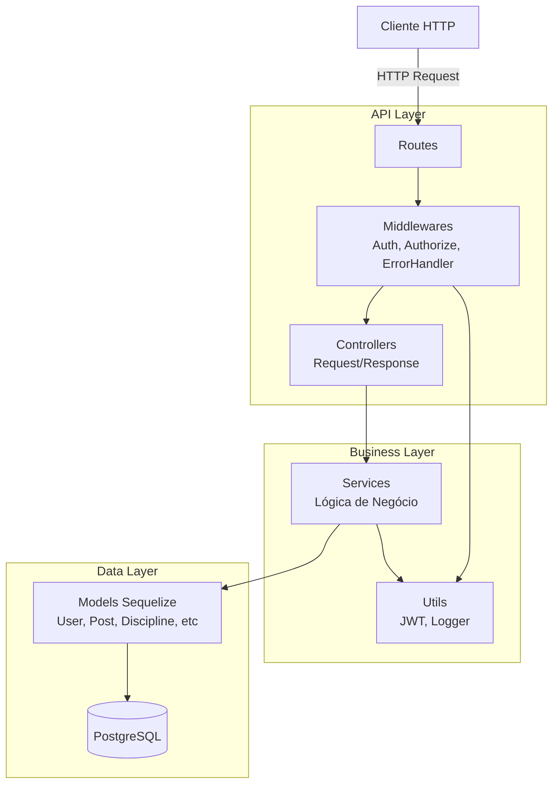
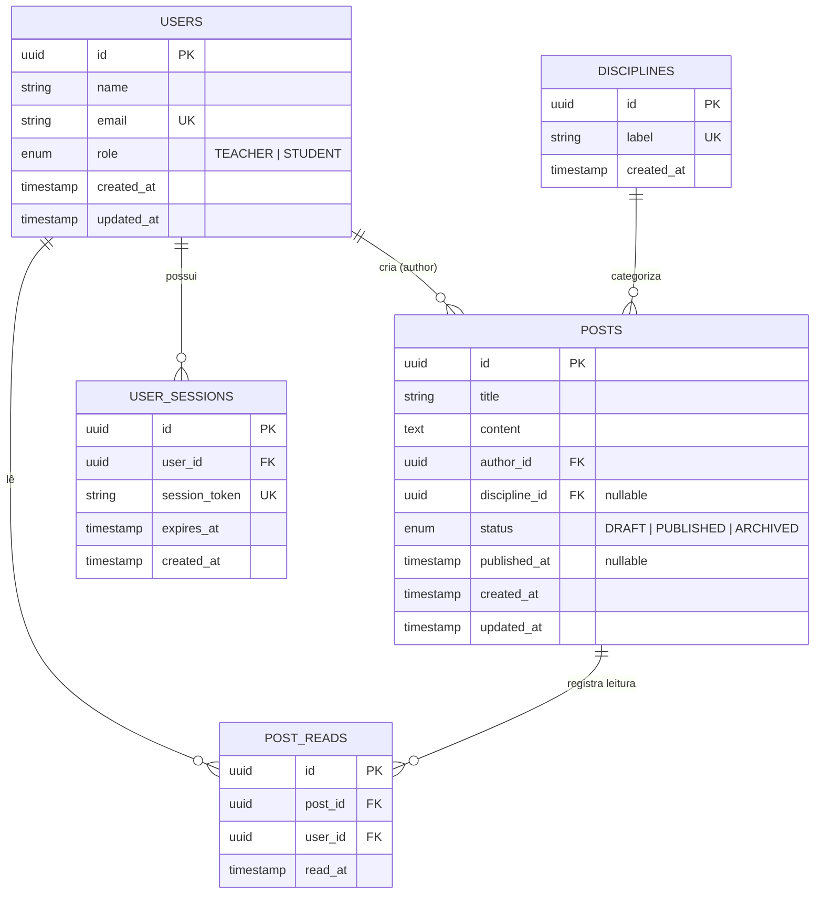
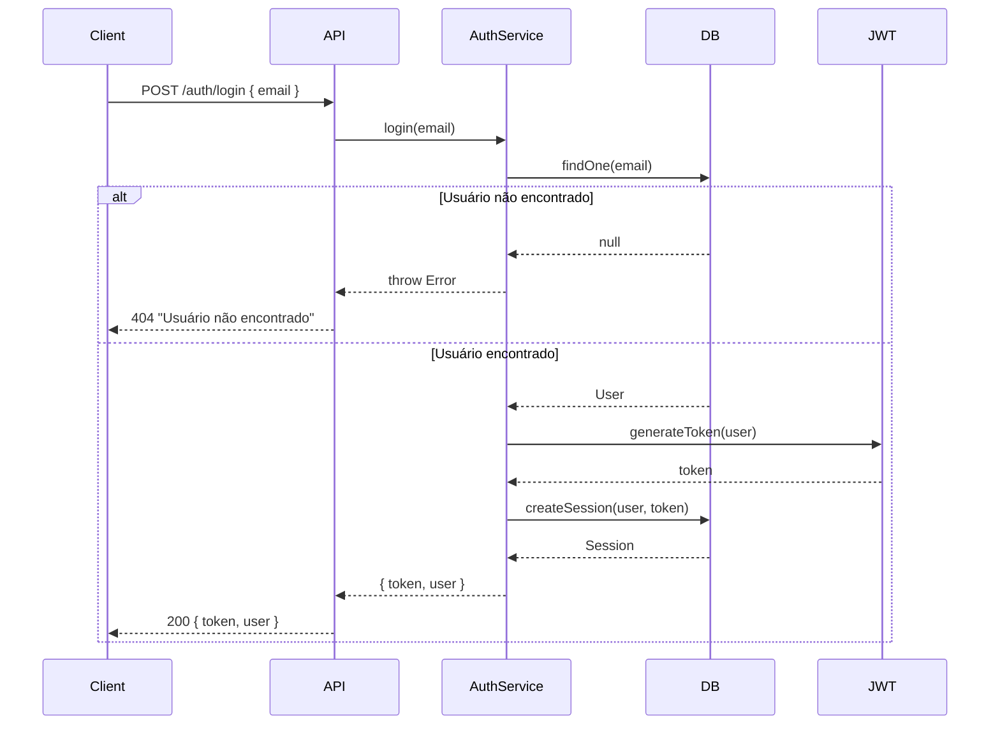
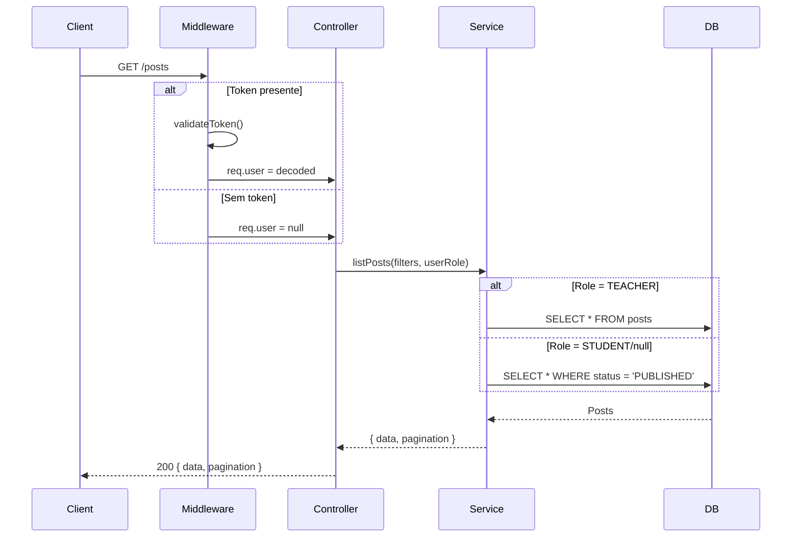
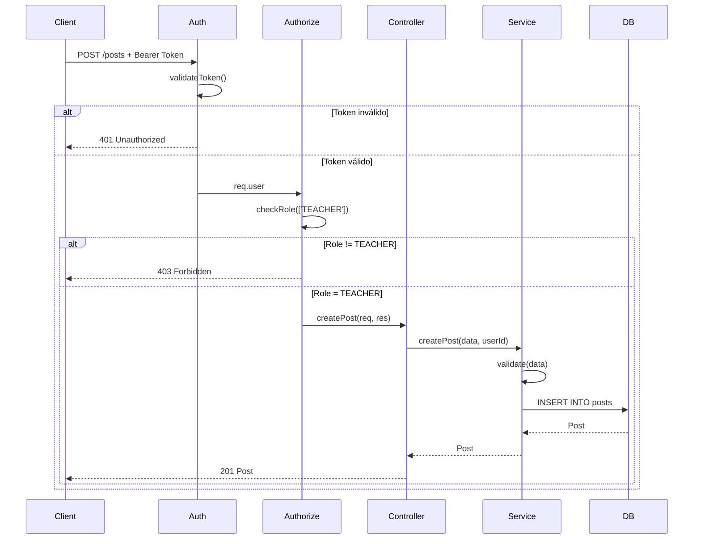
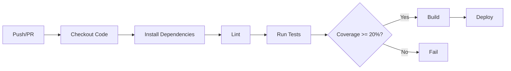

# Tech Challenge Fase 2 - API RESTful de Blogging Educacional

<div align="center">

**Plataforma para Professores da Rede Pública Compartilharem Conteúdo Educacional**

[](https://nodejs.org/)
[](https://www.postgresql.org/)
[](https://expressjs.com/)
[](https://jestjs.io/)

</div>

---

## 📋 Índice

1. [Sobre o Projeto](#-sobre-o-projeto)
2. [Arquitetura do Sistema](#-arquitetura-do-sistema)
3. [Modelagem de Dados](#-modelagem-de-dados)
4. [Documentação da API](#-documentação-da-api)
5. [Fluxos da Aplicação](#-fluxos-da-aplicação)
6. [Setup e Instalação](#-setup-e-instalação)
7. [Testes](#-testes)
8. [Docker](#-docker)
9. [CI/CD](#-cicd)
10. [Dificuldades Encontradas](#-dificuldades-encontradas)
11. [Próximos Passos](#-próximos-passos)

---

## 🎯 Sobre o Projeto

### Contexto

Atualmente, a maioria dos professores da rede pública de educação não têm plataformas onde possam postar suas aulas e transmitir conhecimento para alunos de forma prática, centralizada e tecnológica.

### Solução

Sistema de blogging educacional desenvolvido em Node.js com PostgreSQL, permitindo que professores criem, editem e publiquem conteúdo educacional, enquanto alunos podem visualizar e consumir esse conteúdo de forma organizada por disciplinas.

### Funcionalidades Principais

- **Autenticação Passwordless**: Login simplificado por email com JWT
- **Gestão de Posts**: CRUD completo com controle de status (DRAFT, PUBLISHED, ARCHIVED)
- **Busca Avançada**: Filtros por título, conteúdo e autor
- **Controle de Acesso**: RBAC (Role-Based Access Control) - TEACHER vs STUDENT
- **Visibilidade Inteligente**: Professores veem todos os posts, alunos veem apenas publicados
- **Organização por Disciplinas**: Categorização de conteúdo educacional

### 🛠️ Tecnologias

| Categoria | Tecnologias |
|-----------|-------------|
| **Runtime** | Node.js 18+ |
| **Framework** | Express 4.18+ |
| **Database** | PostgreSQL 15+ |
| **ORM** | Sequelize 6+ |
| **Autenticação** | JWT (jsonwebtoken) |
| **Testes** | Jest 29+ + Supertest |
| **Validação** | Express Validator |
| **Segurança** | Helmet, CORS, Rate Limiting |
| **Dev Tools** | Nodemon, ESLint, Prettier |
| **DevOps** | Docker, Docker Compose, GitHub Actions |

### 📁 Estrutura do Projeto

```
8FSDT-tech-challenge-2/
├── src/
│   ├── config/              # Configurações (database.js)
│   ├── models/              # Models Sequelize (User, Post, etc)
│   ├── services/            # Lógica de negócio
│   │   ├── auth.service.js
│   │   └── post.service.js
│   ├── controllers/         # Request/Response handlers
│   │   ├── auth.controller.js
│   │   └── post.controller.js
│   ├── middlewares/         # Middlewares (auth, authorize, errorHandler)
│   │   ├── authenticate.js
│   │   ├── authorize.js
│   │   └── errorHandler.js
│   ├── routes/              # Definição de rotas
│   │   ├── auth.routes.js
│   │   └── post.routes.js
│   ├── utils/               # Utilitários (jwt.js, logger.js)
│   ├── database/
│   │   ├── migrations/      # Migrações do banco
│   │   └── seeders/         # Seeds de dados
│   └── app.js               # Configuração Express
├── tests/
│   ├── unit/                # Testes unitários
│   │   ├── models.test.js
│   │   └── services/
│   └── integration/         # Testes de integração (futuros)
├── .env.example             # Template de variáveis
├── .sequelizerc             # Config Sequelize CLI
├── jest.config.js           # Config Jest
├── docker-compose.yml       # Orquestração Docker
└── package.json             # Dependências e scripts
```

---

## 🏗️ Arquitetura do Sistema

### Visão Geral

O sistema segue uma arquitetura em camadas (Layered Architecture) com separação de responsabilidades:



### Camadas

1. **API Layer** (Rotas, Middlewares, Controllers)
   - Recebe requisições HTTP
   - Valida autenticação e autorização
   - Formata respostas
   - Trata erros

2. **Business Layer** (Services, Utils)
   - Implementa regras de negócio
   - Valida dados de entrada
   - Gerencia transações complexas

3. **Data Layer** (Models, Database)
   - Abstração do banco de dados via Sequelize
   - Definição de schemas e relacionamentos
   - Queries otimizadas com índices

### Padrões Utilizados

- **MVC Modificado**: Controllers → Services → Models
- **Dependency Injection**: Services injetados nos Controllers
- **Middleware Pattern**: Autenticação, autorização e tratamento de erros
- **Repository Pattern**: Models Sequelize como repositories

---

## 🗄️ Modelagem de Dados

### Diagrama Entidade-Relacionamento



### Descrição das Entidades

#### **Users** (Usuários)
Armazena professores e alunos do sistema.

- **Campos principais**: name, email (único), role (TEACHER/STUDENT)
- **Relacionamentos**: Cria posts, possui sessões, registra leituras
- **Índices**:
  - `users_email_idx` (email) - Busca por login
  - `users_role_idx` (role) - Filtros por tipo de usuário
  - `users_created_at_idx` (created_at) - Ordenação temporal

#### **Posts** (Postagens)
Conteúdo educacional criado por professores.

- **Campos principais**: title, content, status, published_at
- **Relacionamentos**: Pertence a um autor (User) e uma disciplina (Discipline)
- **Status**: DRAFT (rascunho), PUBLISHED (publicado), ARCHIVED (arquivado)
- **Índices**:
  - `posts_author_id_idx` (author_id) - Posts por autor
  - `posts_discipline_id_idx` (discipline_id) - Posts por disciplina
  - `posts_status_idx` (status) - Filtro de visibilidade
  - `posts_published_at_idx` (published_at) - Ordenação por publicação
  - `posts_title_trgm_idx` (title gin_trgm_ops) - Busca fuzzy no título
  - `posts_content_trgm_idx` (content gin_trgm_ops) - Busca fuzzy no conteúdo

#### **Disciplines** (Disciplinas)
Categorização de conteúdo por matéria.

- **Campos principais**: label (único)
- **Relacionamentos**: Possui múltiplos posts
- **Índices**: `disciplines_label_idx` (label) - Busca por nome

#### **PostReads** (Leituras de Posts)
Rastreamento de leitura de posts por alunos.

- **Campos principais**: post_id, user_id, read_at
- **Relacionamentos**: Pertence a um post e um usuário
- **Índices**:
  - `post_reads_post_id_idx` (post_id) - Leituras por post
  - `post_reads_user_id_idx` (user_id) - Leituras por usuário
  - `post_reads_composite_idx` (user_id, post_id) - Constraint única

#### **UserSessions** (Sessões de Usuário)
Gerenciamento de tokens JWT para autenticação passwordless.

- **Campos principais**: session_token (único), expires_at
- **Relacionamentos**: Pertence a um usuário
- **Índices**:
  - `user_sessions_token_idx` (session_token) - Validação de token
  - `user_sessions_user_id_idx` (user_id) - Sessões por usuário
  - `user_sessions_expires_at_idx` (expires_at) - Limpeza de expirados

---

## 📚 Documentação da API

### Base URL

```
http://localhost:3000/api
```

### Autenticação

A API utiliza **autenticação JWT via Bearer Token**. Para endpoints protegidos, inclua o header:

```
Authorization: Bearer <seu_token_jwt>
```

---

### **Endpoints de Autenticação**

#### `POST /auth/login`

**Descrição**: Login passwordless - gera token JWT baseado no email.

**Autenticação**: Não requerida

**Request Body**:
```json
{
  "email": "professor@escola.edu"
}
```

**Response 200 OK**:
```json
{
  "token": "eyJhbGciOiJIUzI1NiIsInR5cCI6IkpXVCJ9...",
  "user": {
    "id": "uuid-do-usuario",
    "name": "Prof. João Silva",
    "email": "professor@escola.edu",
    "role": "TEACHER"
  }
}
```

**Response 404 Not Found**:
```json
{
  "error": "Usuário não encontrado"
}
```

---

#### `POST /auth/logout`

**Descrição**: Invalida o token JWT atual.

**Autenticação**: Requerida

**Headers**:
```
Authorization: Bearer <token>
```

**Response 200 OK**:
```json
{
  "message": "Logout realizado com sucesso"
}
```

**Response 401 Unauthorized**:
```json
{
  "error": "Token inválido ou expirado"
}
```

---

### **Endpoints de Posts**

#### `GET /posts`

**Descrição**: Lista posts com paginação e visibilidade por role.

**Autenticação**: Opcional

**Regras de Visibilidade**:
- **TEACHER** (autenticado): Vê todos os posts (DRAFT, PUBLISHED, ARCHIVED)
- **STUDENT/não autenticado**: Vê apenas posts PUBLISHED

**Query Parameters**:
- `page` (opcional, padrão: 1) - Número da página
- `limit` (opcional, padrão: 20) - Itens por página

**Request**:
```
GET /posts?page=1&limit=10
Authorization: Bearer <token> (opcional)
```

**Response 200 OK**:
```json
{
  "data": [
    {
      "id": "uuid-do-post",
      "title": "Introdução à Álgebra Linear",
      "content": "Conteúdo completo...",
      "status": "PUBLISHED",
      "published_at": "2024-01-15T10:30:00Z",
      "created_at": "2024-01-15T10:00:00Z",
      "updated_at": "2024-01-15T10:30:00Z",
      "author": {
        "id": "uuid-autor",
        "name": "Prof. Maria Santos",
        "role": "TEACHER"
      },
      "discipline": {
        "id": "uuid-disciplina",
        "label": "Matemática"
      }
    }
  ],
  "pagination": {
    "page": 1,
    "limit": 10,
    "total": 45,
    "totalPages": 5
  }
}
```

---

#### `GET /posts/search`

**Descrição**: Busca posts com filtros avançados.

**Autenticação**: Opcional

**Query Parameters**:
- `query` (opcional) - Busca em título OU conteúdo (case-insensitive)
- `title` (opcional) - Busca apenas no título
- `author` (opcional) - Busca por nome do autor
- `page` (opcional, padrão: 1)
- `limit` (opcional, padrão: 20)

**Request**:
```
GET /posts/search?query=álgebra&author=Maria&page=1&limit=10
```

**Response**: Mesma estrutura de `GET /posts`

---

#### `GET /posts/:id`

**Descrição**: Busca post por ID.

**Autenticação**: Requerida

**Request**:
```
GET /posts/550e8400-e29b-41d4-a716-446655440000
Authorization: Bearer <token>
```

**Response 200 OK**:
```json
{
  "id": "550e8400-e29b-41d4-a716-446655440000",
  "title": "Introdução à Álgebra Linear",
  "content": "Conteúdo completo do post...",
  "status": "PUBLISHED",
  "published_at": "2024-01-15T10:30:00Z",
  "created_at": "2024-01-15T10:00:00Z",
  "updated_at": "2024-01-15T10:30:00Z",
  "author": {
    "id": "uuid-autor",
    "name": "Prof. Maria Santos",
    "role": "TEACHER"
  },
  "discipline": {
    "id": "uuid-disciplina",
    "label": "Matemática"
  }
}
```

**Response 404 Not Found**:
```json
{
  "error": "Post não encontrado"
}
```

---

#### `POST /posts`

**Descrição**: Cria novo post.

**Autenticação**: Requerida (apenas TEACHER)

**Request Body**:
```json
{
  "title": "Introdução à Física Quântica",
  "content": "A física quântica estuda o comportamento da matéria...",
  "discipline_id": "uuid-da-disciplina",
  "status": "PUBLISHED"
}
```

**Campos**:
- `title` (obrigatório, 5-255 chars)
- `content` (obrigatório, mín. 10 chars)
- `discipline_id` (opcional, UUID válido)
- `status` (opcional, padrão: DRAFT) - Valores: DRAFT, PUBLISHED, ARCHIVED

**Response 201 Created**: Retorna post criado (mesma estrutura de GET /posts/:id)

**Response 400 Bad Request**:
```json
{
  "error": "Título deve ter no mínimo 5 caracteres"
}
```

**Response 403 Forbidden**:
```json
{
  "error": "Acesso negado. Apenas professores podem criar posts."
}
```

---

#### `PUT /posts/:id`

**Descrição**: Atualiza post existente.

**Autenticação**: Requerida (apenas TEACHER)

**Observação**: Qualquer professor pode editar qualquer post (sem ownership check).

**Request Body** (todos os campos opcionais):
```json
{
  "title": "Novo título",
  "content": "Novo conteúdo",
  "discipline_id": "uuid-nova-disciplina",
  "status": "PUBLISHED"
}
```

**Response 200 OK**: Retorna post atualizado

**Response 404 Not Found**:
```json
{
  "error": "Post não encontrado"
}
```

---

#### `DELETE /posts/:id`

**Descrição**: Deleta post permanentemente (hard delete).

**Autenticação**: Requerida (apenas TEACHER)

**Observação**: Qualquer professor pode deletar qualquer post (sem ownership check).

**Response 204 No Content**: Sem corpo de resposta

**Response 404 Not Found**:
```json
{
  "error": "Post não encontrado"
}
```

---

### **Códigos de Status HTTP**

| Código | Significado | Uso |
|--------|-------------|-----|
| 200 | OK | Requisição bem-sucedida (GET, PUT) |
| 201 | Created | Recurso criado com sucesso (POST) |
| 204 | No Content | Recurso deletado com sucesso (DELETE) |
| 400 | Bad Request | Dados inválidos ou faltando |
| 401 | Unauthorized | Token inválido ou ausente |
| 403 | Forbidden | Sem permissão (role inadequada) |
| 404 | Not Found | Recurso não encontrado |
| 500 | Internal Server Error | Erro interno do servidor |

---

## 🔄 Fluxos da Aplicação

### Fluxo de Autenticação Passwordless



### Fluxo de Listagem de Posts (com Visibilidade por Role)



### Fluxo de Criação de Post (RBAC)



---

## 🚀 Setup e Instalação

### Pré-requisitos

- **Node.js** 18+ ([Download](https://nodejs.org/))
- **PostgreSQL** 15+ ([Download](https://www.postgresql.org/download/))
- **npm** 9+ (incluído com Node.js)

### 1. Instalar Dependências

```bash
npm install
```

### 2. Configurar Variáveis de Ambiente

Copie o arquivo de exemplo:

```bash
cp .env.example .env
```

Edite `.env` com suas configurações:

```env
# Ambiente
NODE_ENV=development
PORT=3000

# Database
DB_HOST=localhost
DB_PORT=5432
DB_NAME=tech_challenge_dev
DB_USER=postgres
DB_PASSWORD=postgres

# JWT
JWT_SECRET=your-super-secret-jwt-key-change-in-production
JWT_EXPIRES_IN=7d

# CORS
ALLOWED_ORIGINS=*
```

### 3. Criar Banco de Dados

```bash
npm run db:create
```

### 4. Rodar Migrações

Cria todas as tabelas e índices:

```bash
npm run db:migrate
```

### 5. Rodar Seeds (opcional)

Popula o banco com dados de exemplo:

```bash
npm run db:seed
```

**Dados criados**:
- 10 usuários (5 TEACHER + 5 STUDENT)
- 5 disciplinas (Matemática, Português, História, Física, Biologia)
- 20 posts de exemplo

### 6. Iniciar Servidor

```bash
npm run dev
```

Servidor rodando em: `http://localhost:3000`

---

## 📜 Scripts Disponíveis

### Desenvolvimento

```bash
npm run dev          # Servidor com hot reload (nodemon)
npm start            # Servidor em modo produção
```

### Testes

#### Configuração do Ambiente de Testes

**1. Criar arquivo .env.test** (copiar do .env.test.example):
```bash
cp .env.test.example .env.test
# Editar .env.test com suas configurações
```

**2. Criar banco de dados de teste:**

Se seu PostgreSQL roda na **porta 5432** (padrão):
```bash
createdb -U postgres blog_api_test
```

Se seu PostgreSQL roda em **outra porta** (ex: 5433):
```bash
createdb -p 5433 -U postgres blog_api_test
# OU usando psql:
psql -p 5433 -U postgres -c "CREATE DATABASE blog_api_test;"
```

Se estiver usando **Docker**:
```bash
docker exec -it postgres-container psql -U postgres -c "CREATE DATABASE blog_api_test;"
```

**3. Rodar os testes:**
```bash
npm test                   # Todos os testes (unit + integration)
npm run test:unit          # Apenas testes unitários
npm run test:integration   # Apenas testes de integração (E2E)
npm run test:watch         # Watch mode (desenvolvimento)
npm run test:coverage      # Com relatório de cobertura
npm run test:ci            # CI mode (para pipelines)
```

**Cobertura Mínima:** 20% (configurado em jest.config.js)

**Total de Testes:** ~67 testes
- Unitários: 33 testes (services, middlewares, models)
- Integração: 34 testes (end-to-end da API)

### Banco de Dados

```bash
npm run db:create          # Criar banco
npm run db:migrate         # Rodar migrações
npm run db:migrate:undo    # Desfazer última migração
npm run db:migrate:undo:all # Desfazer todas
npm run db:seed            # Rodar seeds
npm run db:reset           # Reset completo (undo + migrate + seed)
```

### Docker

```bash
npm run docker:up          # Subir containers
npm run docker:down        # Derrubar containers
npm run docker:logs        # Ver logs
```

### Qualidade de Código

```bash
npm run lint               # ESLint check
npm run format             # Prettier format
```

---

## 🔐 Variáveis de Ambiente

| Variável | Descrição | Padrão | Obrigatória |
|----------|-----------|--------|-------------|
| `NODE_ENV` | Ambiente (development, test, production) | `development` | Não |
| `PORT` | Porta do servidor | `3000` | Não |
| `DB_HOST` | Host do PostgreSQL | `localhost` | Sim |
| `DB_PORT` | Porta do PostgreSQL | `5432` | Sim |
| `DB_NAME` | Nome do banco | - | Sim |
| `DB_USER` | Usuário do banco | - | Sim |
| `DB_PASSWORD` | Senha do banco | - | Sim |
| `JWT_SECRET` | Secret para JWT | - | Sim |
| `JWT_EXPIRES_IN` | Expiração do token | `7d` | Não |
| `ALLOWED_ORIGINS` | Origins CORS | `*` | Não |

---

## 🧪 Testes

### Cobertura Mínima Requerida

O projeto requer **mínimo de 20% de cobertura** de testes (conforme especificação):

- **Branches**: >= 20%
- **Functions**: >= 20%
- **Lines**: >= 20%
- **Statements**: >= 20%

Configurado em `jest.config.js`.

### Executar Testes com Cobertura

```bash
npm run test:coverage
```

**Saída de exemplo**:

```
--------------------|---------|----------|---------|---------|
File                | % Stmts | % Branch | % Funcs | % Lines |
--------------------|---------|----------|---------|---------|
All files           |   45.2  |   38.5   |   52.1  |   44.8  |
 models/            |   85.3  |   75.0   |   90.0  |   85.0  |
  User.js           |   100   |   100    |   100   |   100   |
  Post.js           |   100   |   100    |   100   |   100   |
 services/          |   78.5  |   65.2   |   82.3  |   77.9  |
  post.service.js   |   82.1  |   70.5   |   85.7  |   81.3  |
--------------------|---------|----------|---------|---------|
```

### Testes Implementados

- ✅ **Models** (`tests/unit/models.test.js`)
  - Validação de schemas
  - Relacionamentos entre entidades
  - Métodos de instância

- ✅ **Services** (`tests/unit/services/post.service.test.js`)
  - CRUD de posts
  - Regras de visibilidade por role
  - Validações de negócio

- ⏳ **Integration Tests** (FASE 6)
  - Testes end-to-end de endpoints
  - Autenticação e autorização

---

## 🐳 Docker

### Arquitetura Docker (Planejada - FASE 7)

```
┌─────────────────────────────────────┐
│   Docker Compose Network            │
│                                     │
│  ┌──────────────┐  ┌─────────────┐ │
│  │   Node.js    │  │ PostgreSQL  │ │
│  │   App        │──│   Database  │ │
│  │  (port 3000) │  │ (port 5432) │ │
│  └──────────────┘  └─────────────┘ │
└─────────────────────────────────────┘
```

### docker-compose.yml (Exemplo)

```yaml
version: '3.8'

services:
  db:
    image: postgres:15-alpine
    environment:
      POSTGRES_DB: tech_challenge_dev
      POSTGRES_USER: postgres
      POSTGRES_PASSWORD: postgres
    ports:
      - "5432:5432"
    volumes:
      - postgres_data:/var/lib/postgresql/data

  app:
    build: .
    ports:
      - "3000:3000"
    environment:
      NODE_ENV: production
      DB_HOST: db
      DB_PORT: 5432
    depends_on:
      - db

volumes:
  postgres_data:
```

### Comandos Docker

```bash
# Subir containers
npm run docker:up

# Derrubar containers
npm run docker:down

# Ver logs
npm run docker:logs
```

---

## ⚙️ CI/CD

### GitHub Actions Pipeline (Planejado - FASE 8)

**Workflow**: `.github/workflows/ci.yml`

**Etapas**:
1. **Lint**: ESLint + Prettier check
2. **Test**: Jest com cobertura >= 20%
3. **Build**: Verificação de build
4. **Deploy**: Deploy automático (staging/production)

**Triggers**:
- Push para `main`
- Pull Requests

**Exemplo de Pipeline**:



---

## ⚠️ Dificuldades Encontradas

<!-- Esta seção será preenchida durante o desenvolvimento e documentará os desafios enfrentados pela equipe -->

---

## 👥 Equipe

**Grupo 28**

- **Dario Lacerda** - rm369195
- **Larissa Kramer** - rm370062
- **Mirian Storino** - rm369489
- **Natanael Dias** - rm369334
- **Tiago Victor** - rm370117

---

## 📄 Licença

MIT License - Projeto Educacional

---

## 📝 Próximos Passos

### Status de Desenvolvimento

1. ✅ **Setup Inicial** (FASE 1) - Concluído
2. ✅ **Database** (FASE 2) - Concluído
3. ✅ **Auth Completo** (FASE 3) - Concluído
4. ✅ **Posts CRUD** (FASE 4) - Concluído
5. 🔎 **Post Reads + Disciplines** (FASE 5) - Em validação
6. 🔎 **Integração Final + Testes E2E** (FASE 6) - Em validação
7. 🔎 **Docker** (FASE 7) - Em validação
8. 🛠️ **CI/CD** (FASE 8) - Em andamento
9. ⏳ **Performance** (FASE 9)
10. ⏳ **Swagger** (FASE 10)
11. ⏳ **Deploy** (FASE 11)
12. ⏳ **Buffer & QA** (FASE 12)
13. ⏳ **Documentação final** (FASE 13)

---
