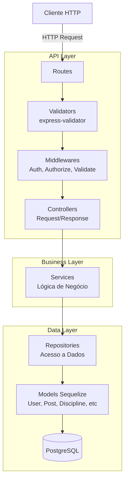
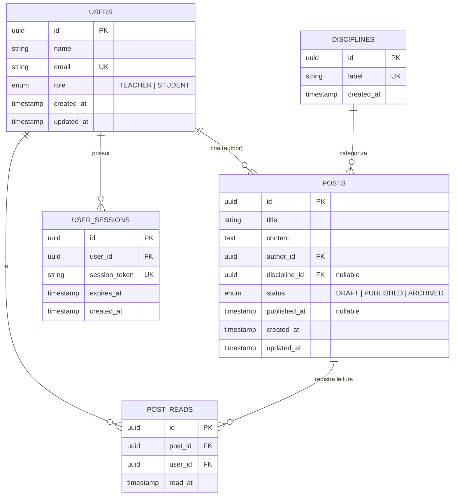
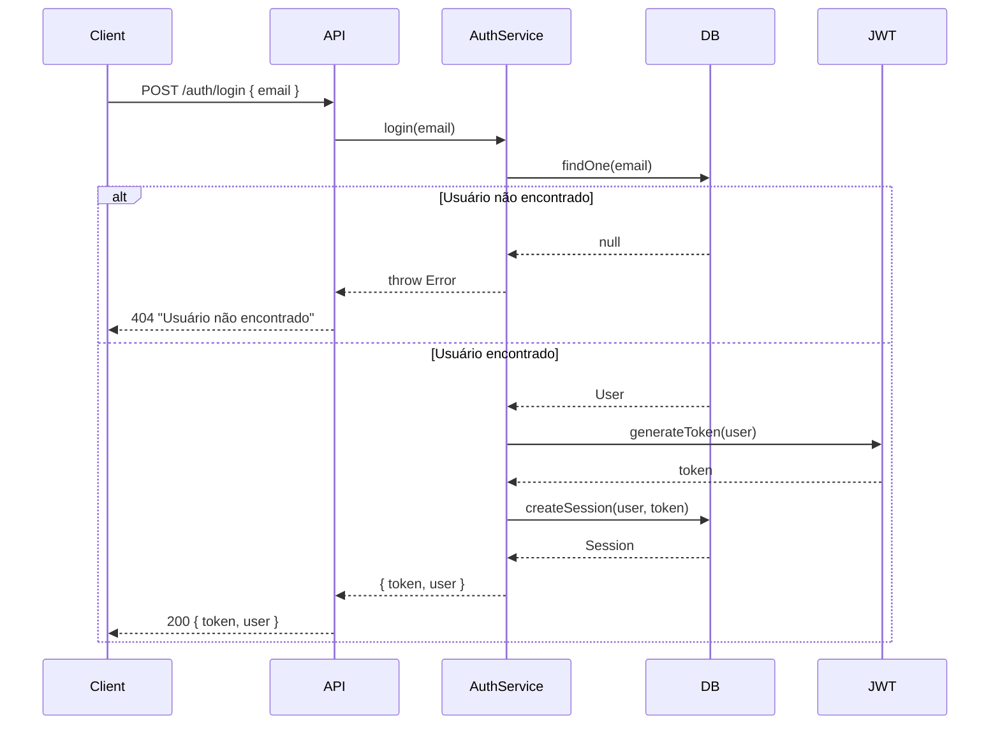
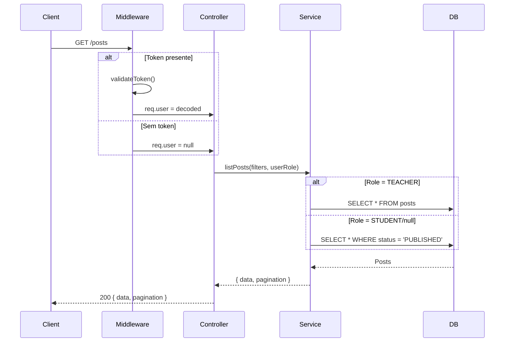
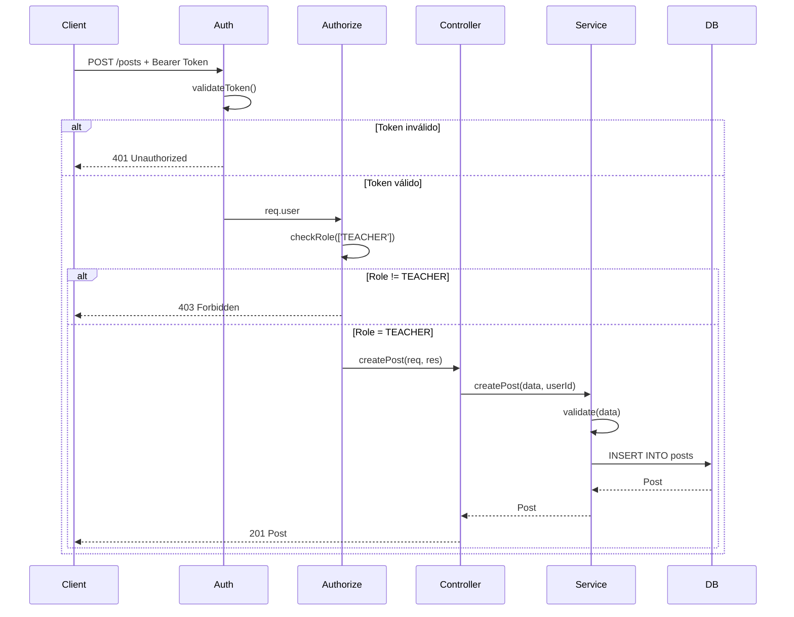
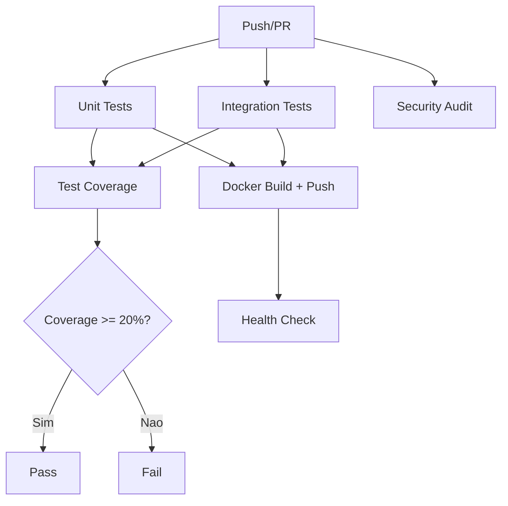

# Tech Challenge Fase 2 - API RESTful de Blogging Educacional

<div align="center">

**Plataforma para Professores da Rede Pública Compartilharem Conteúdo Educacional**

[](https://github.com/natanjunior/8FSDT-tech-challenge-2/actions/workflows/ci.yml)
[](https://github.com/natanjunior/8FSDT-tech-challenge-2/actions/workflows/cd.yml)
[](https://codecov.io/gh/natanjunior/8FSDT-tech-challenge-2)
[](https://opensource.org/licenses/MIT)

[](https://nodejs.org/)
[](https://www.postgresql.org/)
[](https://expressjs.com/)
[](https://jestjs.io/)

</div>

---

## 📋 Índice

1. [Sobre o Projeto](#-sobre-o-projeto)
2. [Arquitetura do Sistema](#-arquitetura-do-sistema)
3. [Modelagem de Dados](#-modelagem-de-dados)
4. [Documentação da API](#-documentação-da-api)
5. [Fluxos da Aplicação](#-fluxos-da-aplicação)
6. [Setup e Instalação](#-setup-e-instalação)
7. [Testes](#-testes)
8. [Docker](#-docker)
9. [CI/CD](#-cicd)
10. [Dificuldades Encontradas](#-dificuldades-encontradas)
11. [Próximos Passos](#-próximos-passos)

---

## 🎯 Sobre o Projeto

Este projeto foi desenvolvido como parte do **Tech Challenge - Fase 2** do curso de **Software Development** da FIAP (turma 8FSDT). A proposta da fase 2 consiste em evoluir a API RESTful de blogging educacional criada na fase 1, aplicando boas praticas de engenharia de software como testes automatizados, containerizacao com Docker e integracao/entrega continua (CI/CD) com GitHub Actions. Alem dos requisitos obrigatorios, a equipe implementou melhorias como Repository Pattern, validacao centralizada com express-validator e Dependency Injection.

### Contexto

Atualmente, a maioria dos professores da rede publica de educacao nao tem plataformas onde possam postar suas aulas e transmitir conhecimento para alunos de forma pratica, centralizada e tecnologica.

### Solucao

Sistema de blogging educacional desenvolvido em Node.js com PostgreSQL, permitindo que professores criem, editem e publiquem conteudo educacional, enquanto alunos podem visualizar e consumir esse conteudo de forma organizada por disciplinas.

### Funcionalidades Principais

- **Autenticação Passwordless**: Login simplificado por email com JWT
- **Gestão de Posts**: CRUD completo com controle de status (DRAFT, PUBLISHED, ARCHIVED)
- **Busca Avançada**: Filtros por título, conteúdo e autor
- **Controle de Acesso**: RBAC (Role-Based Access Control) - TEACHER vs STUDENT
- **Visibilidade Inteligente**: Professores veem todos os posts, alunos veem apenas publicados
- **Organização por Disciplinas**: Categorização de conteúdo educacional

### 🛠️ Tecnologias

| Categoria | Tecnologias |
|-----------|-------------|
| **Runtime** | Node.js 18+ |
| **Framework** | Express 4.18+ |
| **Database** | PostgreSQL 15+ |
| **ORM** | Sequelize 6+ |
| **Autenticação** | JWT (jsonwebtoken) |
| **Testes** | Jest 29+ + Supertest |
| **Validação** | Express Validator |
| **Segurança** | CORS |
| **Dev Tools** | Nodemon, ESLint, Prettier |
| **DevOps** | Docker, Docker Compose, GitHub Actions |

### 📁 Estrutura do Projeto

```
8FSDT-tech-challenge-2/
├── src/
│   ├── config/              # Configurações (database, swagger)
│   ├── controllers/         # Request/Response handlers
│   ├── middlewares/         # Middlewares (auth, authorize, validate)
│   ├── models/              # Models Sequelize (User, Post, etc)
│   ├── repositories/        # Acesso a dados (Repository Pattern)
│   ├── routes/              # Definição de rotas com Swagger docs
│   ├── services/            # Lógica de negócio
│   ├── validators/          # Validação centralizada com express-validator
│   ├── database/
│   │   ├── migrations/      # Migrações do banco
│   │   └── seeders/         # Seeds de dados
│   ├── app.js               # Configuração Express
│   └── server.js            # Entry point do servidor
├── tests/
│   ├── unit/                # Testes unitários (services, middlewares, models)
│   └── integration/         # Testes de integração (E2E)
├── .env.example             # Template de variáveis
├── .eslintrc.json           # Config ESLint
├── .prettierrc              # Config Prettier
├── .sequelizerc             # Config Sequelize CLI
├── Dockerfile               # Build multi-stage (dev/prod)
├── docker-compose.yml       # Orquestração Docker (dev)
├── docker-compose.prod.yml  # Orquestração Docker (prod)
├── jest.config.js           # Config Jest
└── package.json             # Dependências e scripts
```

---

## 🏗️ Arquitetura do Sistema

### Visao Geral

A arquitetura foi organizada em camadas (Layered Architecture) para manter a separacao de responsabilidades e facilitar a manutencao e testabilidade do codigo. Cada camada tem um papel bem definido: a API Layer recebe e valida requisicoes, a Business Layer concentra regras de negocio, e a Data Layer abstrai o acesso ao banco de dados. A adocao do Repository Pattern foi uma decisao da equipe para desacoplar os services do ORM (Sequelize), permitindo que os testes unitarios mockem repositorios em vez de modelos — tornando os testes mais simples e menos frageis.


```mermaid
graph TB
    Client[Cliente HTTP]

    subgraph "API Layer"
        Routes[Routes]
        Middlewares[Middlewares<br/>Auth, Authorize, Validate]
        Controllers[Controllers<br/>Request/Response]
        Validators[Validators<br/>express-validator]
    end

    subgraph "Business Layer"
        Services[Services<br/>Lógica de Negócio]
    end

    subgraph "Data Layer"
        Repositories[Repositories<br/>Acesso a Dados]
        Models[Models Sequelize<br/>User, Post, Discipline, etc]
        DB[(PostgreSQL)]
    end

    Client -->|HTTP Request| Routes
    Routes --> Validators
    Validators --> Middlewares
    Middlewares --> Controllers
    Controllers --> Services
    Services --> Repositories
    Repositories --> Models
    Models --> DB
```

### Camadas

1. **API Layer** (Rotas, Validators, Middlewares, Controllers)
   - Recebe requisições HTTP
   - Valida dados de entrada (express-validator)
   - Valida autenticação e autorização
   - Formata respostas
   - Trata erros

2. **Business Layer** (Services)
   - Implementa regras de negócio
   - Orquestra chamadas aos Repositories

3. **Data Layer** (Repositories, Models, Database)
   - Repositories encapsulam queries ao ORM
   - Models definem schemas e relacionamentos
   - Abstração do banco de dados via Sequelize

### Padrões Utilizados

- **MVC Modificado**: Controllers → Services → Repositories → Models
- **Dependency Injection**: Services injetados nos Controllers
- **Middleware Pattern**: Autenticação, autorização e tratamento de erros
- **Validation Layer**: Validação centralizada com express-validator (fail-fast)
- **Repository Pattern**: Camada `src/repositories/` abstrai acesso a dados dos Services

---

## 🗄️ Modelagem de Dados

O banco de dados foi modelado com 4 entidades principais, utilizando UUIDs como chaves primarias para evitar colisoes e facilitar integracao futura. As sessoes de usuario foram separadas em tabela propria (`UserSessions`) para permitir invalidacao individual de tokens JWT sem afetar outros logins ativos do mesmo usuario.

### Diagrama Entidade-Relacionamento


```mermaid
erDiagram
    USERS ||--o{ POSTS : "cria (author)"
    USERS ||--o{ POST_READS : "lê"
    USERS ||--o{ USER_SESSIONS : "possui"
    DISCIPLINES ||--o{ POSTS : "categoriza"
    POSTS ||--o{ POST_READS : "registra leitura"

    USERS {
        uuid id PK
        string name
        string email UK
        enum role "TEACHER | STUDENT"
        timestamp created_at
        timestamp updated_at
    }

    POSTS {
        uuid id PK
        string title
        text content
        uuid author_id FK
        uuid discipline_id FK "nullable"
        enum status "DRAFT | PUBLISHED | ARCHIVED"
        timestamp published_at "nullable"
        timestamp created_at
        timestamp updated_at
    }

    DISCIPLINES {
        uuid id PK
        string label UK
        timestamp created_at
    }

    POST_READS {
        uuid id PK
        uuid post_id FK
        uuid user_id FK
        timestamp read_at
    }

    USER_SESSIONS {
        uuid id PK
        uuid user_id FK
        string session_token UK
        timestamp expires_at
        timestamp created_at
    }
```

### Descrição das Entidades

#### **Users** (Usuários)
Armazena professores e alunos do sistema.

- **Campos principais**: name, email (único), role (TEACHER/STUDENT)
- **Relacionamentos**: Cria posts, possui sessões, registra leituras
- **Índices**:
  - `users_email_idx` (email) - Busca por login
  - `users_role_idx` (role) - Filtros por tipo de usuário
  - `users_created_at_idx` (created_at) - Ordenação temporal

#### **Posts** (Postagens)
Conteúdo educacional criado por professores.

- **Campos principais**: title, content, status, published_at
- **Relacionamentos**: Pertence a um autor (User) e uma disciplina (Discipline)
- **Status**: DRAFT (rascunho), PUBLISHED (publicado), ARCHIVED (arquivado)
- **Índices**:
  - `posts_author_id_idx` (author_id) - Posts por autor
  - `posts_discipline_id_idx` (discipline_id) - Posts por disciplina
  - `posts_status_idx` (status) - Filtro de visibilidade
  - `posts_published_at_idx` (published_at) - Ordenação por publicação

#### **Disciplines** (Disciplinas)
Categorização de conteúdo por matéria.

- **Campos principais**: label (único)
- **Relacionamentos**: Possui múltiplos posts
- **Índices**: `disciplines_label_idx` (label) - Busca por nome

#### **PostReads** (Leituras de Posts)
Rastreamento de leitura de posts por alunos.

- **Campos principais**: post_id, user_id, read_at
- **Relacionamentos**: Pertence a um post e um usuário
- **Índices**:
  - `post_reads_post_id_idx` (post_id) - Leituras por post
  - `post_reads_user_id_idx` (user_id) - Leituras por usuário
  - `post_reads_composite_idx` (user_id, post_id) - Constraint única

#### **UserSessions** (Sessões de Usuário)
Gerenciamento de tokens JWT para autenticação passwordless.

- **Campos principais**: session_token (único), expires_at
- **Relacionamentos**: Pertence a um usuário
- **Índices**:
  - `user_sessions_token_idx` (session_token) - Validação de token
  - `user_sessions_user_id_idx` (user_id) - Sessões por usuário
  - `user_sessions_expires_at_idx` (expires_at) - Limpeza de expirados

---

## 📚 Documentacao da API

A API segue o padrao REST e disponibiliza documentacao interativa via Swagger em `/api-docs`. Os endpoints abaixo cobrem as funcionalidades requisitadas no Tech Challenge (autenticacao, CRUD de posts, busca) e endpoints adicionais de compatibilidade com a fase 1 (disciplinas e leituras de posts).

### Base URL

```
http://localhost:3000
```

### Autenticação

A API utiliza **autenticação JWT via Bearer Token**. Para endpoints protegidos, inclua o header:

```
Authorization: Bearer <seu_token_jwt>
```

---

### **Endpoints de Autenticação**

#### `POST /auth/login`

**Descrição**: Login passwordless - gera token JWT baseado no email.

**Autenticação**: Não requerida

**Request Body**:
```json
{
  "email": "professor@escola.edu"
}
```

**Response 200 OK**:
```json
{
  "token": "eyJhbGciOiJIUzI1NiIsInR5cCI6IkpXVCJ9...",
  "user": {
    "id": "uuid-do-usuario",
    "name": "Prof. João Silva",
    "email": "professor@escola.edu",
    "role": "TEACHER"
  }
}
```

**Response 404 Not Found**:
```json
{
  "error": "Email não cadastrado"
}
```

---

#### `POST /auth/logout`

**Descrição**: Invalida o token JWT atual.

**Autenticação**: Requerida

**Headers**:
```
Authorization: Bearer <token>
```

**Response 204 No Content**: Sem corpo de resposta

**Response 401 Unauthorized**:
```json
{
  "error": "Token inválido"
}
```

---

### **Endpoints de Posts**

#### `GET /posts`

**Descrição**: Lista posts com paginação e visibilidade por role.

**Autenticação**: Opcional

**Regras de Visibilidade**:
- **TEACHER** (autenticado): Vê todos os posts (DRAFT, PUBLISHED, ARCHIVED)
- **STUDENT/não autenticado**: Vê apenas posts PUBLISHED

**Query Parameters**:
- `page` (opcional, padrão: 1) - Número da página
- `limit` (opcional, padrão: 20) - Itens por página

**Request**:
```
GET /posts?page=1&limit=10
Authorization: Bearer <token> (opcional)
```

**Response 200 OK**:
```json
{
  "data": [
    {
      "id": "uuid-do-post",
      "title": "Introdução à Álgebra Linear",
      "content": "Conteúdo completo...",
      "status": "PUBLISHED",
      "published_at": "2024-01-15T10:30:00Z",
      "created_at": "2024-01-15T10:00:00Z",
      "updated_at": "2024-01-15T10:30:00Z",
      "author": {
        "id": "uuid-autor",
        "name": "Prof. Maria Santos",
        "role": "TEACHER"
      },
      "discipline": {
        "id": "uuid-disciplina",
        "label": "Matemática"
      }
    }
  ],
  "pagination": {
    "page": 1,
    "limit": 10,
    "total": 45,
    "totalPages": 5
  }
}
```

---

#### `GET /posts/search`

**Descrição**: Busca posts com filtros avançados.

**Autenticação**: Opcional

**Query Parameters**:
- `query` (opcional) - Busca em título OU conteúdo (case-insensitive)
- `title` (opcional) - Busca apenas no título
- `author` (opcional) - Busca por nome do autor
- `page` (opcional, padrão: 1)
- `limit` (opcional, padrão: 20)

**Request**:
```
GET /posts/search?query=álgebra&author=Maria&page=1&limit=10
```

**Response**: Mesma estrutura de `GET /posts`

---

#### `GET /posts/:id`

**Descrição**: Busca post por ID.

**Autenticação**: Requerida

**Request**:
```
GET /posts/550e8400-e29b-41d4-a716-446655440000
Authorization: Bearer <token>
```

**Response 200 OK**:
```json
{
  "id": "550e8400-e29b-41d4-a716-446655440000",
  "title": "Introdução à Álgebra Linear",
  "content": "Conteúdo completo do post...",
  "status": "PUBLISHED",
  "published_at": "2024-01-15T10:30:00Z",
  "created_at": "2024-01-15T10:00:00Z",
  "updated_at": "2024-01-15T10:30:00Z",
  "author": {
    "id": "uuid-autor",
    "name": "Prof. Maria Santos",
    "role": "TEACHER"
  },
  "discipline": {
    "id": "uuid-disciplina",
    "label": "Matemática"
  }
}
```

**Response 404 Not Found**:
```json
{
  "error": "Post não encontrado"
}
```

---

#### `POST /posts`

**Descrição**: Cria novo post.

**Autenticação**: Requerida (apenas TEACHER)

**Request Body**:
```json
{
  "title": "Introdução à Física Quântica",
  "content": "A física quântica estuda o comportamento da matéria...",
  "discipline_id": "uuid-da-disciplina",
  "status": "PUBLISHED"
}
```

**Campos**:
- `title` (obrigatório, 5-255 chars)
- `content` (obrigatório, mín. 10 chars)
- `discipline_id` (opcional, UUID válido)
- `status` (opcional, padrão: DRAFT) - Valores: DRAFT, PUBLISHED, ARCHIVED

**Response 201 Created**: Retorna post criado (mesma estrutura de GET /posts/:id)

**Response 400 Bad Request**:
```json
{
  "error": "Título deve ter no mínimo 5 caracteres"
}
```

**Response 403 Forbidden**:
```json
{
  "error": "Acesso negado. Apenas professores podem criar posts."
}
```

---

#### `PUT /posts/:id`

**Descrição**: Substitui post por completo (todos os campos obrigatórios).

**Autenticação**: Requerida (apenas TEACHER)

**Observação**: Qualquer professor pode editar qualquer post (sem ownership check).

**Request Body** (campos obrigatórios):
```json
{
  "title": "Título completo",
  "content": "Conteúdo completo",
  "status": "PUBLISHED",
  "discipline_id": "uuid-disciplina (opcional)"
}
```

**Response 200 OK**: Retorna post substituído

**Response 400 Bad Request**: Campos obrigatórios ausentes

**Response 404 Not Found**:
```json
{
  "error": "Post não encontrado"
}
```

---

#### `PATCH /posts/:id`

**Descrição**: Atualiza parcialmente um post existente (apenas campos enviados são alterados).

**Autenticação**: Requerida (apenas TEACHER)

**Observação**: Qualquer professor pode editar qualquer post (sem ownership check).

**Request Body** (todos os campos opcionais):
```json
{
  "title": "Novo título",
  "content": "Novo conteúdo",
  "discipline_id": "uuid-nova-disciplina",
  "status": "PUBLISHED"
}
```

**Response 200 OK**: Retorna post atualizado

**Response 404 Not Found**:
```json
{
  "error": "Post não encontrado"
}
```

---

#### `DELETE /posts/:id`

**Descrição**: Deleta post permanentemente (hard delete).

**Autenticação**: Requerida (apenas TEACHER)

**Observação**: Qualquer professor pode deletar qualquer post (sem ownership check).

**Response 204 No Content**: Sem corpo de resposta

**Response 404 Not Found**:
```json
{
  "error": "Post não encontrado"
}
```

---

### Disciplines (Disciplinas)

> **Nota**: Endpoints criados para manter a compatibilidade com o tech challenge da fase 1.

#### `GET /disciplines`

Lista todas as disciplinas cadastradas, ordenadas por label (A-Z).

**Autenticação**: Requerida

**Response 200 OK**:
```json
[
  {
    "id": "uuid",
    "label": "Matemática",
    "created_at": "2024-01-01T00:00:00.000Z",
    "updated_at": "2024-01-01T00:00:00.000Z"
  }
]
```

**Response 401 Unauthorized**:
```json
{
  "error": "Token não fornecido"
}
```

---

### Post Reads (Leitura de Posts)

> **Nota**: Endpoints criados para manter a compatibilidade com o tech challenge da fase 1.

#### `POST /posts/:id/read`

Marca um post como lido pelo usuário autenticado. Operação idempotente — marcar o mesmo post mais de uma vez retorna o mesmo registro.

**Autenticação**: Requerida

**Response 201 Created**:
```json
{
  "id": "uuid",
  "post_id": "uuid",
  "user_id": "uuid",
  "read_at": "2024-01-01T10:00:00.000Z"
}
```

**Response 404 Not Found**:
```json
{
  "error": "Post não encontrado"
}
```

#### `GET /posts/:id/read`

Verifica se o usuário autenticado já leu o post especificado.

**Autenticação**: Requerida

**Response 200 OK**:
```json
{
  "read": true,
  "read_at": "2024-01-01T10:00:00.000Z"
}
```

Caso o post não tenha sido lido:
```json
{
  "read": false,
  "read_at": null
}
```

---

### **Códigos de Status HTTP**

| Código | Significado | Uso |
|--------|-------------|-----|
| 200 | OK | Requisição bem-sucedida (GET, PUT) |
| 201 | Created | Recurso criado com sucesso (POST) |
| 204 | No Content | Recurso deletado com sucesso (DELETE) |
| 400 | Bad Request | Dados inválidos ou faltando |
| 401 | Unauthorized | Token inválido ou ausente |
| 403 | Forbidden | Sem permissão (role inadequada) |
| 404 | Not Found | Recurso não encontrado |
| 500 | Internal Server Error | Erro interno do servidor |

---

## 🔄 Fluxos da Aplicacao

Os diagramas abaixo documentam os tres fluxos que melhor demonstram as regras de negocio da aplicacao: a autenticacao passwordless (sem senha), a visibilidade de posts condicionada ao role do usuario e o controle de acesso (RBAC) na criacao de conteudo.

### Fluxo de Autenticacao Passwordless


```mermaid
sequenceDiagram
    participant Client
    participant API
    participant AuthService
    participant DB
    participant JWT

    Client->>API: POST /auth/login { email }
    API->>AuthService: login(email)
    AuthService->>DB: findOne(email)

    alt Usuário não encontrado
        DB-->>AuthService: null
        AuthService-->>API: throw Error
        API-->>Client: 404 "Usuário não encontrado"
    else Usuário encontrado
        DB-->>AuthService: User
        AuthService->>JWT: generateToken(user)
        JWT-->>AuthService: token
        AuthService->>DB: createSession(user, token)
        DB-->>AuthService: Session
        AuthService-->>API: { token, user }
        API-->>Client: 200 { token, user }
    end
```

### Fluxo de Listagem de Posts (com Visibilidade por Role)


```mermaid
sequenceDiagram
    participant Client
    participant Middleware
    participant Controller
    participant Service
    participant DB

    Client->>Middleware: GET /posts

    alt Token presente
        Middleware->>Middleware: validateToken()
        Middleware->>Controller: req.user = decoded
    else Sem token
        Middleware->>Controller: req.user = null
    end

    Controller->>Service: listPosts(filters, userRole)

    alt Role = TEACHER
        Service->>DB: SELECT * FROM posts
    else Role = STUDENT/null
        Service->>DB: SELECT * WHERE status = 'PUBLISHED'
    end

    DB-->>Service: Posts
    Service-->>Controller: { data, pagination }
    Controller-->>Client: 200 { data, pagination }
```

### Fluxo de Criação de Post (RBAC)


```mermaid
sequenceDiagram
    participant Client
    participant Auth
    participant Authorize
    participant Controller
    participant Service
    participant DB

    Client->>Auth: POST /posts + Bearer Token
    Auth->>Auth: validateToken()

    alt Token inválido
        Auth-->>Client: 401 Unauthorized
    else Token válido
        Auth->>Authorize: req.user
        Authorize->>Authorize: checkRole(['TEACHER'])

        alt Role != TEACHER
            Authorize-->>Client: 403 Forbidden
        else Role = TEACHER
            Authorize->>Controller: createPost(req, res)
            Controller->>Service: createPost(data, userId)
            Service->>Service: validate(data)
            Service->>DB: INSERT INTO posts
            DB-->>Service: Post
            Service-->>Controller: Post
            Controller-->>Client: 201 Post
        end
    end
```

---

## 🚀 Setup e Instalação

### Pré-requisitos

- **Node.js** 18+ ([Download](https://nodejs.org/))
- **PostgreSQL** 15+ ([Download](https://www.postgresql.org/download/))
- **npm** 9+ (incluído com Node.js)

### 1. Instalar Dependências

```bash
npm install
```

### 2. Configurar Variáveis de Ambiente

Copie o arquivo de exemplo:

```bash
cp .env.example .env
```

Edite `.env` com suas configurações:

```env
# Ambiente
NODE_ENV=development
PORT=3000

# Database
DB_HOST=localhost
DB_PORT=5432
DB_NAME=tech_challenge_dev
DB_USER=postgres
DB_PASSWORD=postgres

# JWT
JWT_SECRET=your-super-secret-jwt-key-change-in-production
JWT_EXPIRES_IN=24h

# CORS
ALLOWED_ORIGINS=*
```

### 3. Criar Banco de Dados

```bash
npm run db:create
```

### 4. Rodar Migrações

Cria todas as tabelas e índices:

```bash
npm run db:migrate
```

### 5. Rodar Seeds (opcional)

Popula o banco com dados de exemplo:

```bash
npm run db:seed
```

**Dados criados**:
- 4 usuários (2 TEACHER + 2 STUDENT)
- 5 disciplinas (Matemática, Português, História, Física, Biologia)
- 5 posts de exemplo (4 PUBLISHED + 1 DRAFT)

### 6. Iniciar Servidor

```bash
npm run dev
```

Servidor rodando em: `http://localhost:3000`

---

## 📜 Scripts Disponíveis

### Desenvolvimento

```bash
npm run dev          # Servidor com hot reload (nodemon)
npm start            # Servidor em modo produção
```

### Testes

#### Configuração do Ambiente de Testes

**1. Criar arquivo .env.test** (copiar do .env.test.example):
```bash
cp .env.test.example .env.test
# Editar .env.test com suas configurações
```

**2. Criar banco de dados de teste:**

Se seu PostgreSQL roda na **porta 5432** (padrão):
```bash
createdb -U postgres blog_api_test
```

Se seu PostgreSQL roda em **outra porta** (ex: 5433):
```bash
createdb -p 5433 -U postgres blog_api_test
# OU usando psql:
psql -p 5433 -U postgres -c "CREATE DATABASE blog_api_test;"
```

Se estiver usando **Docker**:
```bash
docker exec -it postgres-container psql -U postgres -c "CREATE DATABASE blog_api_test;"
```

**3. Rodar os testes:**
```bash
npm test                   # Todos os testes (unit + integration)
npm run test:unit          # Apenas testes unitários
npm run test:integration   # Apenas testes de integração (E2E)
npm run test:watch         # Watch mode (desenvolvimento)
npm run test:coverage      # Com relatório de cobertura
npm run test:ci            # CI mode (para pipelines)
```

**Cobertura Mínima:** 20% (configurado em jest.config.js)

**Total de Testes:** ~102 testes
- Unitários: 68 testes (services, middlewares, models)
- Integração: 34 testes (end-to-end da API)

### Banco de Dados

```bash
npm run db:create          # Criar banco
npm run db:migrate         # Rodar migrações
npm run db:migrate:undo    # Desfazer última migração
npm run db:migrate:undo:all # Desfazer todas
npm run db:seed            # Rodar seeds
npm run db:reset           # Reset completo (undo + migrate + seed)
```

### Docker

```bash
npm run docker:up          # Subir containers
npm run docker:down        # Derrubar containers
npm run docker:logs        # Ver logs
```

### Qualidade de Código

```bash
npm run lint               # ESLint check
npm run format             # Prettier format
```

---

## 🔐 Variáveis de Ambiente

| Variável | Descrição | Padrão | Obrigatória |
|----------|-----------|--------|-------------|
| `NODE_ENV` | Ambiente (development, test, production) | `development` | Não |
| `PORT` | Porta do servidor | `3000` | Não |
| `DB_HOST` | Host do PostgreSQL | `localhost` | Sim |
| `DB_PORT` | Porta do PostgreSQL | `5432` | Sim |
| `DB_NAME` | Nome do banco | - | Sim |
| `DB_USER` | Usuário do banco | - | Sim |
| `DB_PASSWORD` | Senha do banco | - | Sim |
| `JWT_SECRET` | Secret para JWT | - | Sim |
| `JWT_EXPIRES_IN` | Expiração do token JWT e sessão | `24h` | Não |
| `ALLOWED_ORIGINS` | Origins CORS | `*` | Não |

---

## 🧪 Testes

A especificacao do Tech Challenge requer um minimo de 20% de cobertura de testes. A equipe optou por ir alem, implementando testes unitarios para todas as camadas de logica (services, middlewares, models) e testes de integracao end-to-end para todos os endpoints da API, totalizando ~102 testes.

### Cobertura Minima Requerida

O projeto requer **minimo de 20% de cobertura** de testes (conforme especificacao):

- **Branches**: >= 20%
- **Functions**: >= 20%
- **Lines**: >= 20%
- **Statements**: >= 20%

Configurado em `jest.config.js`.

### Executar Testes com Cobertura

```bash
npm run test:coverage
```

### Testes Implementados

#### Unitarios (68 testes)

- **Models** (`tests/unit/models.test.js`) — Validacao de schemas, relacionamentos entre entidades, metodos de instancia

- **Services**:
  - `tests/unit/services/post.service.test.js` — CRUD de posts, regras de visibilidade por role, validacoes de negocio
  - `tests/unit/services/auth.service.test.js` — Login passwordless, geracao/verificacao de tokens JWT, gerenciamento de sessoes
  - `tests/unit/services/discipline.service.test.js` — Listagem ordenada de disciplinas
  - `tests/unit/services/postRead.service.test.js` — Marcacao de leitura, idempotencia, verificacao de status

- **Middlewares**:
  - `tests/unit/middlewares/authenticate.test.js` — Validacao de token JWT, sessao expirada, token ausente
  - `tests/unit/middlewares/authorize.test.js` — Controle de acesso por role (RBAC)

#### Integracao (34 testes)

- `tests/integration/auth.integration.test.js` — Fluxo completo de login/logout
- `tests/integration/posts.integration.test.js` — CRUD end-to-end, paginacao, busca, visibilidade por role
- `tests/integration/disciplines.integration.test.js` — Listagem de disciplinas com autenticacao
- `tests/integration/postReads.integration.test.js` — Marcacao e verificacao de leitura end-to-end

---

## 🐳 Docker

A containerizacao foi implementada conforme requisitado no Tech Challenge. O ambiente de desenvolvimento utiliza Docker Compose com tres servicos: a API Node.js, o banco PostgreSQL e o PgAdmin para gerenciamento visual. O Dockerfile utiliza multi-stage build com targets separados para desenvolvimento (com hot reload via nodemon e volume mount do codigo-fonte) e producao (imagem otimizada sem devDependencies).

### Arquitetura Docker

```
┌──────────────────────────────────────────────────────┐
│   Docker Compose Network (blog_network)              │
│                                                      │
│  ┌──────────────┐  ┌─────────────┐  ┌────────────┐ │
│  │   Node.js    │  │ PostgreSQL  │  │  PgAdmin   │ │
│  │   API        │──│   Database  │  │  (Web UI)  │ │
│  │  (port 3030) │  │ (port 5433) │  │ (port 5050)│ │
│  └──────────────┘  └─────────────┘  └────────────┘ │
└──────────────────────────────────────────────────────┘
```

### docker-compose.yml

```yaml
services:
  postgres:
    image: postgres:15-alpine
    container_name: blog_api_postgres
    restart: unless-stopped
    environment:
      POSTGRES_USER: postgres
      POSTGRES_PASSWORD: root
      POSTGRES_DB: blog_api_dev
    ports:
      - "5433:5432"
    volumes:
      - postgres_data:/var/lib/postgresql/data
      - ./scripts/init-db.sql:/docker-entrypoint-initdb.d/init-db.sql
    networks:
      - blog_network
    healthcheck:
      test: ["CMD-SHELL", "pg_isready -U postgres"]
      interval: 10s
      timeout: 5s
      retries: 5

  api:
    build:
      context: .
      dockerfile: Dockerfile
      target: development
    container_name: blog_api_app
    restart: unless-stopped
    environment:
      NODE_ENV: development
      PORT: 3030
      DB_HOST: postgres
      DB_PORT: 5432
      DB_USER: postgres
      DB_PASSWORD: root
      DB_NAME: blog_api_dev
      JWT_SECRET: ${JWT_SECRET:-dev_secret_super_seguro_minimo_32_caracteres}
    ports:
      - "3030:3030"
    volumes:
      - ./src:/app/src
      - ./package.json:/app/package.json
      - /app/node_modules
    depends_on:
      postgres:
        condition: service_healthy
    networks:
      - blog_network
    command: npm run dev

  pgadmin:
    image: dpage/pgadmin4:latest
    container_name: blog_api_pgadmin
    restart: unless-stopped
    environment:
      PGADMIN_DEFAULT_EMAIL: admin@admin.com
      PGADMIN_DEFAULT_PASSWORD: admin
      PGADMIN_LISTEN_PORT: 80
    ports:
      - "5050:80"
    volumes:
      - pgadmin_data:/var/lib/pgadmin
    depends_on:
      - postgres
    networks:
      - blog_network

networks:
  blog_network:
    driver: bridge

volumes:
  postgres_data:
    driver: local
  pgadmin_data:
    driver: local
```

### Comandos Docker

```bash
# Subir containers
npm run docker:up

# Derrubar containers
npm run docker:down

# Ver logs
npm run docker:logs
```

---

## ⚙️ CI/CD

O pipeline de CI/CD foi implementado com GitHub Actions conforme requisitado no Tech Challenge. O CI garante que nenhum merge aconteca sem todos os testes passando e com cobertura minima de 20%. Alem dos requisitos obrigatorios, a equipe adicionou security audit automatizado, build e health check da imagem Docker, e push automatico para o Docker Hub em merges na main. O CD possui a estrutura de deploy para staging e production, porem o deploy real nao foi implementado — os jobs permanecem como placeholders.

### CI Pipeline (`.github/workflows/ci.yml`)

**Triggers**: Push para `main`/`develop` e Pull Requests

**Jobs**:

| Job | Nome | Descricao | Dependencias |
|-----|------|-----------|-------------|
| 1 | **Unit Tests** | Roda `npm run test:unit` | — |
| 2 | **Integration Tests** | Sobe PostgreSQL, roda migrations e `npm run test:integration` | — |
| 3 | **Test Coverage** | Roda `npm run test:coverage`, verifica threshold >= 20%, upload Codecov | Jobs 1 + 2 |
| 4 | **Docker Build** | Builda imagem Docker, push para Docker Hub (apenas em push para `main`), health check | Jobs 1 + 2 |
| 5 | **Security Audit** | Roda `npm audit --audit-level=moderate` | — |

### CD Pipeline (`.github/workflows/cd.yml`)

**Triggers**: Push para `main` (staging) e tags `v*.*.*` (production)

| Job | Nome | Trigger | Descricao |
|-----|------|---------|-----------|
| 1 | **Deploy to Staging** | Push para `main` | Placeholder — deploy real nao implementado |
| 2 | **Deploy to Production** | Tag `v*.*.*` | Placeholder — cria GitHub Release |

### Diagrama do Pipeline


```mermaid
graph TD
    A[Push/PR] --> B[Unit Tests]
    A --> C[Integration Tests]
    A --> E[Security Audit]
    B --> D[Test Coverage]
    C --> D
    B --> F[Docker Build + Push]
    C --> F
    D --> G{Coverage >= 20%?}
    G -->|Sim| H[Pass]
    G -->|Nao| I[Fail]
    F --> J[Health Check]
```

---

## ⚠️ Dificuldades Encontradas

<!-- Esta seção será preenchida durante o desenvolvimento e documentará os desafios enfrentados pela equipe -->

---

## 👥 Equipe

**Grupo 28**

- **Dario Lacerda** - rm369195
- **Larissa Kramer** - rm370062
- **Mirian Storino** - rm369489
- **Natanael Dias** - rm369334
- **Tiago Victor** - rm370117

---

## 📄 Licença

MIT License - Projeto Educacional

---

## 📝 Próximos Passos

### Status de Desenvolvimento

1. ✅ **Setup Inicial** (FASE 1) - Concluído
2. ✅ **Database** (FASE 2) - Concluído
3. ✅ **Auth Completo** (FASE 3) - Concluído
4. ✅ **Posts CRUD** (FASE 4) - Concluído
5. ✅ **Post Reads + Disciplines** (FASE 5) - Concluído
6. ✅ **Integração Final + Testes E2E** (FASE 6) - Concluído
7. ✅ **Docker** (FASE 7) - Concluído
8. ✅ **CI/CD** (FASE 8) - Em validação
9. 🛠️ **Performance** (FASE 9) - Em andamento
10. 🔎 **Swagger** (FASE 10) - Concluído
11. ✅ **Deploy** (FASE 11) - Concluído
12. ⏳ **Buffer & QA** (FASE 12)
13. ⏳ **Documentação final** (FASE 13)

---
